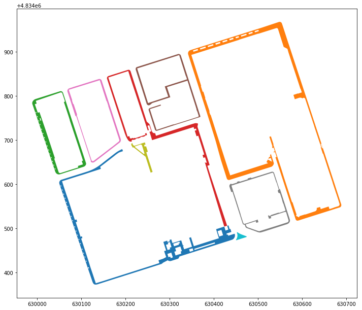
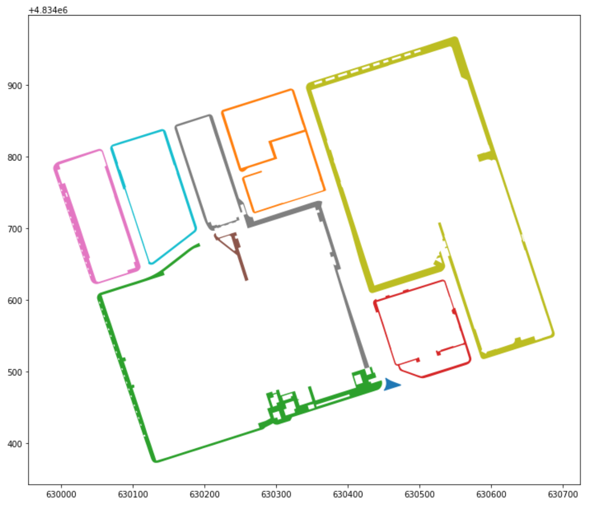
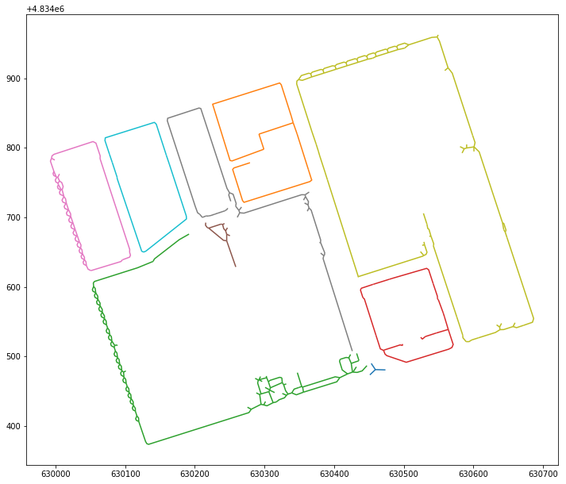
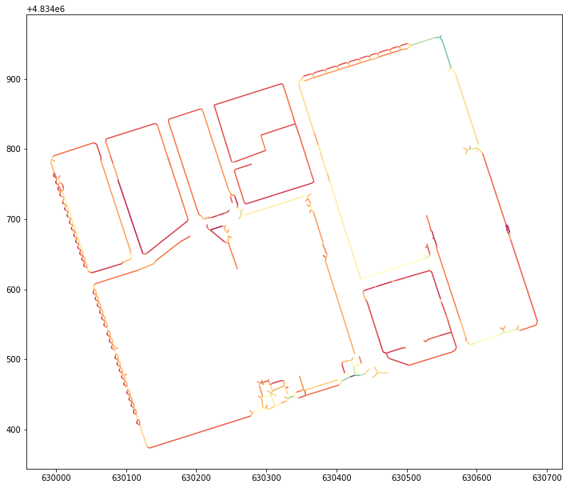

# Sidewalk Widths Toronto

Sidewalk Widths Toronto uses the [City of Toronto's open sidewalk dataset](https://open.toronto.ca/dataset/topographic-mapping-physical-area-of-sidewalks/) to produce a map of sidewalk widths for the city.

This is inspired by, and forked from, Meli Harvey's [Sidewalk Widths NYC](http://www.sidewalkwidths.nyc) project. We borrow [methods and code](https://github.com/meliharvey/sidewalkwidths-nyc) from the original project.

This repo contains the notebooks to reproduce this work, as well as the finished Sidewalk Width dataset in GeoJSON format.

## Link
[https://sharedstreets.github.io/sidewalkwidths-toronto/](https://sharedstreets.github.io/sidewalkwidths-toronto/)

## Methodology

1) Polygons from City of Toronto's open data portal:

2) Dissolved touching sidewalk polygons (this example doesn't show a difference)

3) Find sidewalk centerlines

4) Remove short ends and simplify

5) Measure distance from centerlines to original polygon

------------------

## Acknowledgements

This repo is adapted from [Meli Harvey](https://github.com/meliharvey/)'s original work. The Toronto dataset was created with python debugging and cloud processing help from [Jennings Anderson](https://github.com/jenningsanderson), as well as input from [Raphael Dumas](https://github.com/radumas) at the City of Toronto. Thanks!
